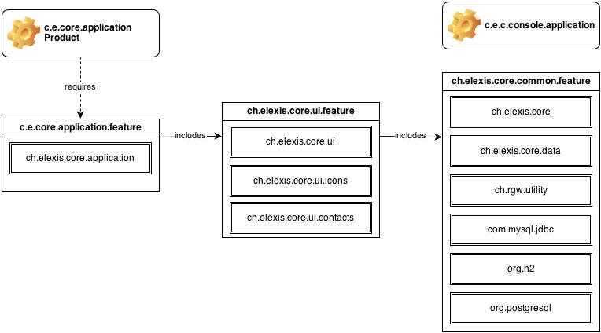

Elexis 3 Core Repository
========================

__*ALPHA STATE*__

This repository hosts the core forming Elexis 3. It consists of the following plug-ins and features:

* `ch.rgw.utility` Utilities required to drive Elexis.
* `ch.elexis.core` Core concepts and interface definitions.
* `ch.elexis.core.data` Core persistence and functionality packages and classes.
* `ch.elexis.core.console.application` Headless Elexis application.
* `ch.elexis.core.ui` User Interface dependent portions. Dependent on Eclipse RCP 3.x.
* `ch.elexis.core.application` Core UI Elexis Application.
* `ch.elexis.core.releng` Release Engineering specific parts (Build Target, 3rd party ...)
* `ch.elexis.core.icons` Plug-In for central icon management.
* `ch.elexis.core.common.feature`	Headless Core Feature.
* `ch.elexis.core.feature` Core Feature.
* `ch.elexis.core.application.feature` Core Application Feature.

For details about the resp. plug-ins/features switch to the respective directory. The plug-ins and features
are contained and inter-dependent as follows:

!

