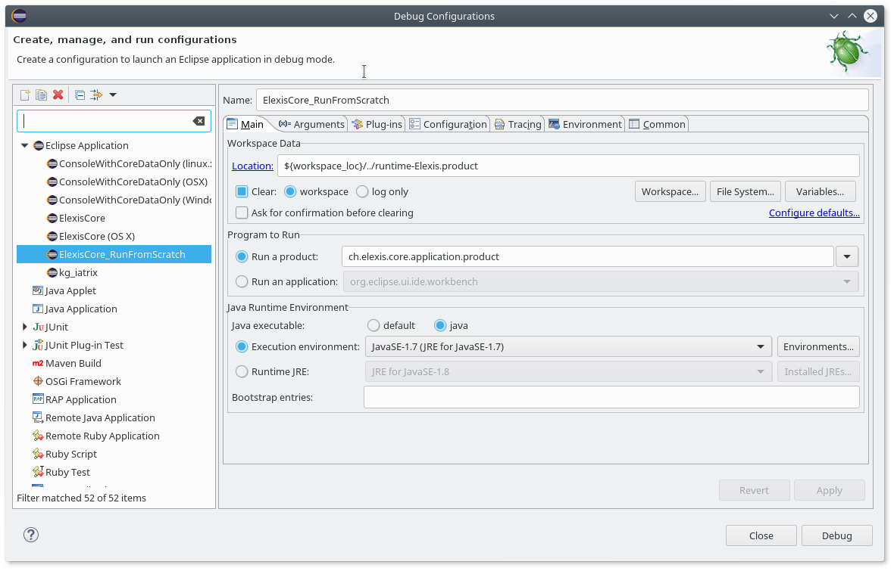

# Elexis SDK
## Building Elexis
IMPORTANT Please employ the Eclipse_builtin.xml as Eclipse default formatter
prior to development and pull requests. It only deviation to the Eclipse 21-12
builtin formatter is the use of tabs instead of spaces to indent.

[Build status of master branch](https://gitlab.medelexis.ch/elexis/elexis-3-core/badges/master/pipeline.svg)

## Install latest build

Go to [Jenkins-CI
Builds](https://download.elexis.info/elexis/master/products).

Download and unzip the zip file for your machine. An JRE 11 is bundled with the product.

Start the Elexis3 application.

Use Help..Install New Software to add the desired features from the
elexis-3-base P2 repository.
### Maven based build

You need Java 1.11. Maven \>= 3.6. On Debian 10 (buster) install adoptopenjdk-11-hotspot.
Then you should be able to generate the application and p2 update site using the following calls:


`git clone https://github.com/elexis/elexis-3-core`\
`mvn -V clean verify  -Dtycho.localArtifacts=ignore -DskipTests -Dmaterialize-products`

Explanation of the used options

-   -V: emits version of Java, Maven, GUI-Toolkit, Architecture. Handy
    when you ask a problem
-   clean: Build everything from scratch
-   verify: Compile, test and build a P2-site including products. But
    does NOT install maven artefacts
-   -Dtycho.localArtifacts=ignore: Do not use any locally built maven
    artefacts
-   -DskipTests: Skip unit tests (Use it only if you want to speed up
    the build)
-   -Dmaterialize-products: Building products is optional, as it takes
    some time. This includes building products.
-   ---quiet: Used for travis builds to generate Quiet output - only
    show errors. Without it the log would bee too long and make the
    travis-build fail.
-   If the environment variable MATERIALIZE_PRODUCTS is set to false, no
    zip files for all products will be produced, which speeds up the
    build

It will be built for your OS/Window-System/Architecture combination. You
will find the executables under
`ch.elexis.core.p2site/target/products/ch.elexis.core.application.ElexisApp/*/*/*`

Note: This will fail in MacOSX. Build instructions for Mac:

`Install Homebrew`\
`brew install homebrew/versions/maven30`\
`git clone https://github.com/elexis/elexis-3-core`\
`mvn clean install -DskipTests`

### Continuos Intergration builds

Medelexis sponsored a gitlab runner for the continuos integrations build. 
The status can be seen under 
[Build status of master branch](https://gitlab.medelexis.ch/elexis/elexis-3-core/badges/master/pipeline.svg)

The downloads produced by these runs can found under <http://download.elexis.info/elexis/>

### Building via Eclipse IDE

If you want a complete development environment, try
[Oomph](https://github.com/elexis/elexis-3-core/tree/master/ch.elexis.sdk)

This is the recommended (and the only supported) setup of an development environment
for Elexis developers.

### Building using devenv.sh

For details consult [deven.sh](https://devenv.sh/). Resuming [getting started](https://devenv.sh/getting-started/) it should be sufficient to run these steps. Tested the multi-user installation under debian bookworm.

    sh <(curl -L https://nixos.org/nix/install) --daemon
    nix profile install --accept-flake-config nixpkgs#devenv --extra-experimental-features flakes --extra-experimental-features nix-command
    # install direnv, eg. debian sudo apt install direnv
    direnv allow

Now you should be able to use maven e.g via

    mvn -V clean verify  -Dtycho.localArtifacts=ignore -Dmaterialize-products

### Eclipse IDE-Preferences

We recommend (and if you want to submit patches, you have to respect)
the following settings in the Eclipse IDE, reachabel via
Window..Preferences:

-   General..Workspace
    -   Select UTF-8 as "Textfile encoding"
    -   Select UNIX as "New text file line delimiter"
-   Java..Code Style..Formatter
    - Click on "Import.." and select the Elexis_formatter_2022_03.xml from the root directory of the elexis-3-core checkout
-   Java..Code Style..Formatter and select as active profile "Eclipse [built-in]
-   Java..Editor..Save Action
    -   Select: Perform the selected actions on save
    -   Select: Format source code and Format edited lines
    -   Select: Organize imports
    -   Do NOT select: Additional actions
-   Maven..Errors/Warning
    -   Set "Plugin execution not covered by lifecycle configuration" to
        "Ignore"

### Code formatting

In March 2022 we decided to drop our custom `3lexisFormatterProfile` in favor
of the Eclipse built-in. This works better for newer Java features like annotations.
Also the line length increases from 100 to 120 chars, as we assume that few of
our developers still use VT-80 terminals.

To ensure a consistent look, we use the [this pre-commit framework](https://pre-commit.com/).
For details have look at the [.pre-commit-config.yaml](https:.pre-commit-config.yaml)

To use it, install the pre-commit framework, either via your distribution or via `pip install pre-commit`.
Under Debian run `apt install pre-commit`. The call once `pre-commit install` to activate the pre-commit
trigger for git. This is not mandatory, as for pull requests this is action runs automatically.


The different parts can be run on the command line, eg. 

* For all files `pre-commit run --all-files file-contents-sorter`
* For a single file `pre-commit run file-contents-sorter --files 'bundles/ch.elexis.core/src/ch/elexis/core/model/ch/messages_it.properties`

You will see and output like

```
File Contents Sorter.....................................................Failed
- hook id: file-contents-sorter
- exit code: 1
- files were modified by this hook

Sorting bundles/ch.elexis.core/src/ch/elexis/core/model/ch/messages_it.properties
```

At the moment we use the following hooks:
* enforce-eclipse-format
  As the enforce-eclipse-format **takes a long time** (over 60 seconds on my machine) it is only called **manually** and as a **github action on pull-requests**. To run it call: `pre-commit run --hook-stage manual enforce-eclipse-format --show-diff-on-failure --all-files`
* check-xml
* check-yaml
* file-contents-sorter
* trailing-whitespace
* mixed-line-ending
* end-of-file-fixer

Creating a custom config file is explained [here](https://code.revelc.net/formatter-maven-plugin/examples.html#custom-configuration-file)

### Submitting patches

To submit patches you have to

-   Fork our github repository to your personal account
-   Clone this repository on your devevelopment machine
-   Create a new branch (eg. `git checkout -b my_branch`)
-   Commit your change (eg. `git commmit -m "My cool changes")
    * Push it to your account (eg. `git push ---set-upstream origin
    my_branch@)
-   Go to your github repository and create a pull requests by clicking
    on the greeen button "Compare & pull request"
-   Review your changes. There should be only the lines that contribute
    to the problem. If you have too many changes look at the remarks
    about Eclipse IDE-Preferences

## Developer Overview

This repository hosts the core Elexis 3. It consists of the following
plug-ins and features:

-   `ch.rgw.utility` Utilities required to drive Elexis.
-   `ch.elexis.core` Core concepts and interface definitions.
-   `ch.elexis.core.data` Core persistence and functionality packages
    and classes.
-   `ch.elexis.core.console.application` Headless Elexis application.
-   `ch.elexis.core.ui` User Interface dependent portions. Dependent on
    Eclipse RCP 3.x.
-   `ch.elexis.core.application` Core UI Elexis Application.

```{=html}
<!-- -->
```
-   `ch.elexis.core.releng` Release Engineering specific parts (Build
    Target, 3rd party ...)

```{=html}
<!-- -->
```
-   `ch.elexis.core.logging` Plug-In for starting ch.qos.logback logging
    (via slf4j interface)
-   `ch.elexis.core.logging.feature` Feature for logging and Felix-gogo
    console
-   `ch.elexis.core.logging.default_configuration` Default logging
    configuration (logback.xml)

```{=html}
<!-- -->
```
-   `ch.elexis.core.ui.icons` Plug-In for central icon management.
-   `ch.elexis.core.ui.contacts` Plug-In for contact management.
-   `ch.elexis.core.ui.laboratory` Plug-In for laboratory related tasks.
-   `ch.elexis.core.ui.p2` Plug-In to realize client side p2 update
    tasks
-   `ch.elexis.core.common.feature` Headless Core Feature.
-   `ch.elexis.core.ui.feature` Core UI Feature.
-   `ch.elexis.core.application.feature` Core Application Feature.

For details about the resp. plug-ins/features switch to the respective
directory. The plug-ins and features\
are contained and inter-dependent as follows:


### Guidelines for developing a new plugin/feature

New plugins and features should follow the E4 (eclipse 4) guideline. A
good tutorial is from [Lars
Vogel](https://www.vogella.com/tutorials/EclipseRCP/article.html)

The ch.elexis.core.ui.tasks follows new e4 implementation rules. Analyse
its working and adapt it to your problem.

### Generate Javadoc

Elexis uses Javadoc to documents its API interface. The Eclipse IDE
offers built-in support for reading the javadoc for a given method or
class and provides also helper to generate it.

This is accomplished by calling
`mvn -DforceContextQualifier=javadoc javadoc:javadoc`. It generates a
complete javadoc. The generated output can be search at
[target/site/apidocs/index.html](target/site/apidocs/index.html).

Even when theses javadoc are not used often, they provide a convenient
way to get an overview over methods, packages, etc.

### Check whether Javadocs are correctly generated

We use checkstyle to generate Javadoc. Use the following command line:

`mvn checkstyle:checkstyle-aggregate site:site`

This generates an browsable HTML file
[target/site/index.html](target/site/index.html). The links to the
modules do not work, unless you call afterwards
`ch.elexis.core.releng/cleanup_after_checkstyle.rb`, a small ruby script
which generates a few missing links (not supported on Windows).

It uses the rules defined in `ch.elexis.core.releng/checkstyle.xml` to
generate warnings for missing Javadoc. For each project, there exists an
error report. E.g
[target/site/ch.rgw.utility/checkstyle.html](./target/site/ch.rgw.utility/checkstyle.html).
An aggregated, overall statistics can be found under
[target/site/checkstyle-aggregate.html](target/site/checkstyle-aggregate.html)

If you want to add even more checks, look at
ch.elexis.core.releng/checkstyle_full.xml. Adding new checks should be
discussed on the developers mailing list.

### Updating all versions for a newer ID

We do this for all new major version, eg. 3.9 -\> 3.10. See also
http://www.mojohaus.org/versions-maven-plugin/usage.html

Steps to follow are:

-   Update the version in master pom.xml
-   Run
    `mvn org.eclipse.tycho:tycho-versions-plugin:set-version -DnewVersion=3.10.0-SNAPSHOT`
    `grep --files-with-match 3.9.0 bundles/*/META-INF/MANIFEST.MF | xargs sed -i 's/3.9.0/3.10.0/g'`

-   Test and check whether the old version number is still present in
    other files.

### Localisation / translation

We are in a transition phase to use trema and support french and italien
versions of elexis. For details see
[l10n.md](bundles/ch.elexis.core.l10n/doc/l10n.md)

*MEDEVIT \<office@medevit.at\>* Last update: 12.10.2022

This project is used to automatically set-up an Elexis 3 development
environment using the [Eclipse Oomph
Installer](http://wiki.eclipse.org/Eclipse_Oomph_Installer). It
integrates both core, base and [Medelexis](http://www.medelexis.ch)
resources. This project is not used outside of the Oomph installer tool.

This documentation was verified with Oomph v1.27.0 Build 5664 (with an
embedded JRE) and used the “Eclipse IDE for RCP and RAP Developers -
2022-09”. The setup file referenced in this document is located in the
root of this git repository (that is `../Elexis.setup` )

## Developing Elexis

Eclipse Oomph is a toolkit to realize automated installations of project
specific Eclipse installations. It is hence used to set-up Eclipse for a
specific project. In order to employ Oomph to setup an Elexis
development environment we proceed as follows:

1.  Download Oomph specific to your system from
    <https://wiki.eclipse.org/Eclipse_Installer> 
2.  Start Oomph (eclipse installer) and switch to the *Advanced* wizard
    <br>  
3.  In the advanced wizard select *Eclipse for RCP and RAP developers*
    as `Product` and select **Next\>** 
4.  Now you see the list of `Projects`, here you have to add the setup
    file for Elexis. Save the link
    <https://raw.githubusercontent.com/elexis/elexis-3-core/master/ch.elexis.sdk/Elexis.setup>
    . e.g as /tmp/Elexis.setup. Add it as follows <br>
      
    With OOMP 1.3.0 the https-URL did not work and you must add the
    Elexis.setup via the File system.
5.  Now you add the required Elexis parts to your installation setup.
    There exist four different parts
    1.  `Elexis` (
        [elexis-3-core](https://github.com/elexis/elexis-3-core/) and
        [elexis-3-base](https://github.com/elexis/elexis-3-base/) ) -
        contains the base open source elexis, a github account is
        required
    2.  `Medelexis` - the Medelexis plugins part, only accessible to
        users who have access to the Medelexis repo
    3.  `Medelexis Application` - the core Medelexis application, only
        accessible to core Medelexis developers
    4.  `Austria` (
        [elexis-3-austria](https://github.com/elexis/elexis-3-austria) )
        - setup for plugins specific to Austrian requirements , requires
        github account
6.  for a default open source development environment in the master
    stream select the projects as follows <br>
     and press **Next\>**. 
7.  the first time you use the installer you have to provide some
    additional information. Select “Show all variables” and please be
    careful to select the correct github username and/or access type,
    otherwise the installationw will fail. <br>
    
8.  You have to select the installation folder name, use `elexis` or
    whatever fits you. Here you will finally find your pre-configured
    development environment for Elexis open source.
9.  Pressing **Next\>** again you can verify the tasks being executed
     and start the installation with
    **Finish**. This will take a while.
10. After the basic product installation was done, the newly installed
    Eclipse IDE is started and the setup tasks are executed (source
    checkout, IDE configuration etc.).
11. If you some of your variables were wrong (e.g. wrong path for a Java
    JDK). The setup will not complete and you must correct the choices,
    via “Help..Performe Setup Tasks”. There press **Back\>** to be able
    to review the variables.
12. Right click on ch.elexis.target/elexis.tpd and select “Set as Target
    Platform”, wait for “Resolving Target Definition” to finish,
13. Rebuild everything via the menu Project..Clean
14. If a window “Errors in Workspace” pops up, ignore or correct the
    errors.
15. ensure that you have as default java a Java-8 version or compiling
    via maven will fail. Check it using `mvn -version`
16. You must run first on the command-line `mvn -V clean verify
    -DskipTests` to guild the needed directories src-gen in
    ch.elexis.core.jpa.entities, etc.
17. Double-click on `ch.elexis.core.p2site/Elexis.product`. Click the
    “Launch an Eclipse application in Debug mode”. Ignore the warning
    and you should get a dialog to select a database for elexis.
18. If you want to restart debugging, then open the menu “Run..Debug
    Configuration” and select in the left selection pane the “Eclipse
    application/Elexis.product” item. Adapt the arguments etc to suit
    your needs [Startoptionen](https://wiki.elexis.info/Startoptionen)
    contains hints for commonly used option
    
19. Press Debug to launch a very minimal Elexis.
20. Ignore warnings in the pop-up windows for
    `org.osgi.framework.system.packages.extra` and `commons-logging`,
    `woodstox-core-asl`
21. Open `Run..Debug Configurations..` Copy Elexis.product and give it a
    name. If you set in the `Arguments` tab `VM Arguments` to

<!-- end list -->

    -Duser.language=de -Duser.region=CH -Dfile.encoding=utf-8
    -Dch.elexis.dbFlavor=h2 -Dch.elexis.dbSpec='jdbc:h2:~/h2_elexis_rcptt_de/db;AUTO_SERVER=TRUE'
    -Dch.elexis.dbUser=sa -Dch.elexis.dbPw=
    -Dch.elexis.firstMandantName=Mustermann -Dch.elexis.firstMandantPassword=elexisTest -Dch.elexis.firstMandantEmail=mmustermann@elexis.info
    -Dch.elexis.username=Mustermann -Dch.elexis.password=elexisTest

you will connect directly to a newly created h2-database.

## Troubleshooting

We have seen cases where parts of the setup could not be installed. I
might help if you

  - Fork the elexis-3-core and elexis-3-base projects in github before
    running the OOMP installer, or you will experience problems with the
    checkout
  - remove the BundlePool. Its name is shown near the bottom of the
    first screen after switching to the Advanced mode.
  - restart the installation.

If the problem persists, open a bug report or send a mail to elexis
[developer mailing list](elexis-develop@lists.sourceforge.net)
